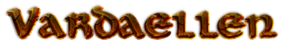

Vardaellen is a small, generic Campaign Setting for core PFRPG, released as whole to the public for free use hunder the `Open Game License`_ (OGL).

You can find the `Campaign Setting itself here <Vardaellen campaign setting_>`_ .

Below are some technical and legal details behind the whole project and, the most important, how you can help.

Vardaellen's Mission
#####################

 * To build a simple PFRPG Reference and generic Campaign Setting that can be freely used (under the terms of the `Open Game License`_) as:

  * a digital, easy to navigate (if compared to a book), light (if compared to a PDF or a site with ads) digital reference for regular tabletop games;
  * a safe-to-use reference without the `PFRPG Product Identities`_ (non-free content) that are `allegedly present even on the official PRD`_;
  * a ready-to-use reference for software development, including games (by becoming free of Product Identities, as mentioned above, but also by providing most tables in easy-to-use formats, like json).
 
 Please note that those are "goals", before that point is actually reached there's much work to do - and that is why every help is appreciated.

.. _`PFRPG Product Identities`: http://paizo.com/pathfinderRPG/prd/openGameLicense.html

.. _`allegedly present even on the official PRD`: http://paizo.com/threads/rzs2ut24?PRD-content-licensing-GameMastery-GuidePlanar#4

.. _`Vardaellen campaign setting`: https://lukems.github.io/vardaellen/

.. _OGL: `Open Game License`_

.. _`Open Game License`: https://lukems.github.io/vardaellen/#open-game-license-v1-0a

The `ReStructuredText version`_ (of the Vardaellen Campaign Setting) contains comments about real world lore, mythology and other influences behind some parts that got rewritten (eg. The Planes)

.. _`ReStructuredText version`: index.rst

Legal Motivations
#####################

You can also see `this forum post`_, if you want, but I will try to explain here better than I did there.
When the D&D 3.5 SRD was released it created a lot of hype, after all, the whole ruleset of the most famous RPG was released to the public under a generous license, the `Open Game License`_. According to the OGL's official FAQ:

 Q: What is "Open Game Content"?
 A: Open Game Content is any material that is distributed using the Open Game License **clearly identified by the publisher as Open Game Content**. Furthermore, **any material that is derived from Open Game Content automatically becomes Open Game Content as well**.
 
 Q: What does "clearly identified" mean? 
 A: It means that the publisher has a burden to use some system to identify Open Game Content to any recipient of that content. Systems which have been used by some publishers include placing Open Game Content in shaded boxes, using a different font, italicizing or bolding the Open Game Content, and segregating all the Open Game Content into specifically designated chapters or appendixes. **Some publishers have released documents that are identified as being comprised completely of Open Game Content** [(and so the SRDs and PRDs were created)].
 "Clearly identified" means that the system should pass the "reasonable person" test; meaning that a reasonable person should be able to determine what portions of a given work are Open Game Content, and which portions are not. If you can't figure out what parts of a given work are Open Game Content, provided you exert a reasonable effort to read and apply the instructions for identification provided by the publisher, then the material isn't Clearly Identified.
 This also applies to software. A reasonable person should be able to look at a piece of software and find and understand the Open Content. We'll make a slight allowance that they may have to take a little more time to understand some things, but they should be able to see and understand all Open Content. See the Software FAQ for more details.[emphasis added]

When D&D 3.5 SRD was released under the OGL, PFRPG was built upon it.
In the spirit of the OGL, the same way that D&D was released trough a SRD, PFRPG did the same with its PRD - they were obligated to release derivative materials under the same license.
If you take a look at the PRD page about The Planes, for instance, 3/4 of it came from the SRD and 1/4 was added by PFRPG's writers.
But, unfortunately, not all of the content there is considered Open Game Content and, worst of all, there is no clear distinction about what is and what isn't.
D&D's 3.5 SRD was **very specific** about what was Open Game Content and what wasn't.
At the beginning of each rtf file (thats the clumsy format they released the SRD under, but let us not complain!) they clearly said:
 "This material is Open Game Content, and is licensed for public use under the terms of the Open Game License v1.0a."
Also, there was a "Legal.rtf" that named what, specifically, was considered Product Identity (not Open Game Content):
 "The following items are designated Product Identity, as defined in Section 1(e) of the Open Game License Version 1.0a, and are subject to the conditions set forth in Section 7 of the OGL, and are not Open Content: Dungeons & Dragons, D&D, Player’s Handbook, Dungeon Master, Monster Manual, d20 System, Wizards of the Coast, d20 (when used as a trademark), Forgotten Realms, Faerûn, proper names (including those used in the names of spells or items), places, Red Wizard of Thay, the City of Union, Heroic Domains of Ysgard, Ever-Changing Chaos of Limbo, Windswept Depths of Pandemonium, Infinite Layers of the Abyss, Tarterian Depths of Carceri, Gray Waste of Hades, Bleak Eternity of Gehenna, Nine Hells of Baator, Infernal Battlefield of Acheron, Clockwork Nirvana of Mechanus, Peaceable Kingdoms of Arcadia, Seven Mounting Heavens of Celestia, Twin Paradises of Bytopia, Blessed Fields of Elysium, Wilderness of the Beastlands, Olympian Glades of Arborea, Concordant Domain of the Outlands, Sigil, Lady of Pain, Book of Exalted Deeds, Book of Vile Darkness, beholder, gauth, carrion crawler, tanar’ri, baatezu, displacer beast, githyanki, githzerai, mind flayer, illithid, umber hulk, yuan-ti.

 All of the rest of the SRD is Open Game Content as described in Section 1(d) of the License."

If you read the `PRD's license`_, however, they use terms such as "proper names (characters, deities, etc.), dialogue, plots, storylines, locations, characters, artworks, and trade dress" to declare Product Identity, nothing specific like D&D 3.5 SRD did. And considering that, back to the page about the Planes as an example, 3/4 of that page contains plot, storylines, locations and characters, under the OGL, from D&D, but the other 1/4, the PFRPG part naming the Outter Planes, etc. could be considered Product Identity, that practically makes the PRD unusable.

.. _`this forum post`: http://paizo.com/threads/rzs2ut24?PRD-content-licensing-GameMastery-GuidePlanar

.. _`PRD's license`: http://paizo.com/pathfinderRPG/prd/openGameLicense.html
.. _`Vardaellen campaign setting`: https://lukems.github.io/vardaellen/